产品因需求而生，在产品的整个生命周期中，产品经理会收到来自各个方面的需求，但是每一个需求的必要性、重要性和实现成本都需要经过深思熟虑的分析和计划，避免盲目的决定需求或者变更需求，这样很容易导致工作混乱，所以产品经理首要的管理工作就是对需求进行管理。

<!-- more -->

## 一、需求识别

### 伪需求的类型

- 伪需求类型1：用户说的不是需求，而是解决方案

- 伪需求类型2：因为某种价值取向，而隐瞒需求
- 伪需求类型3：解决了一个需求，却会影响另一个需求
- 伪需求类型4：不符合用户习惯的需求
- 伪需求类型5：场景、市场评估不足

> 伪需求，轻则浪费资源，功能被砍，重则关乎公司成败。

### 辨别伪需求的技巧

- 分析用户：分析用户规模、特点、用户类型
- 分析目标：不但要听用户怎么说，还要看用户怎么做，不能直接照着用户说的做，而要分析用户的目标
- 分析场景：存不存在、频次如何？
- 以数据为标准
- 以成本为考量

### 需求类型辨别-KANO模型

> **来源**：Kano模型是东京理工大学教授狩野纪昭（Noriaki Kano）1984年发明的对用户需求分析、分类和需求优先级排序的模型。是受行为科学家赫兹伯格的双因素理论启发而来。
>
> 赫兹伯格通过研究发现，企业员工的满意度分两种：激励因素和保健因素。只有激励因素才能给人们带来满意感，而保健因素只能消除人们的不满，但不会带来满意感。
>
> 受此启发，为了提高日本企业的产品和服务满意度，狩野纪昭构建出了kano模型，定义了三个层次的顾客需求：基本型需求、期望型需求、兴奋型需求

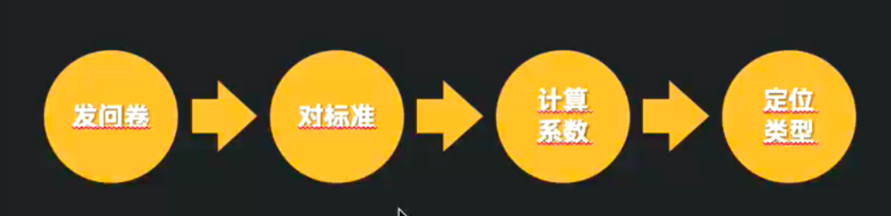

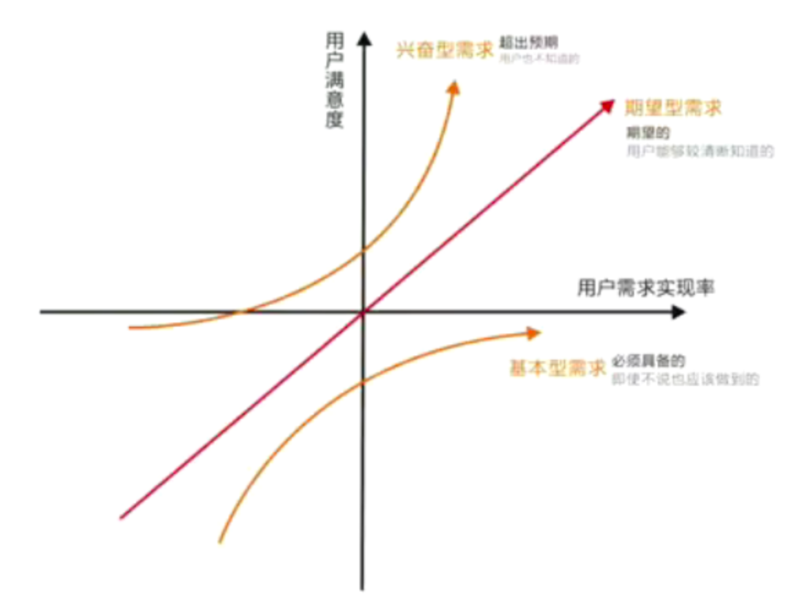

KANO模型衍生的需求的5类属性

1. 必备属性：当优化此需求，用户满意度不会提升，当不提供此需求，用户满意度会大幅降低

2. 期望属性：当提供此需求，用户满意度会提升，当不提供此需求，用户满意度会降低

3. 魅力属性：用户意想不到的，如果不提供此需求，用户满意度不会降低，但当提供此需求，用户满意度会有很大提升

4. 无差异属性：无论提供或不提供此需求，用户满意度都不会有改变，用户根本不在意

5. 反向属性：用户根本都没有此需求，提供后用户满意度反而会下降

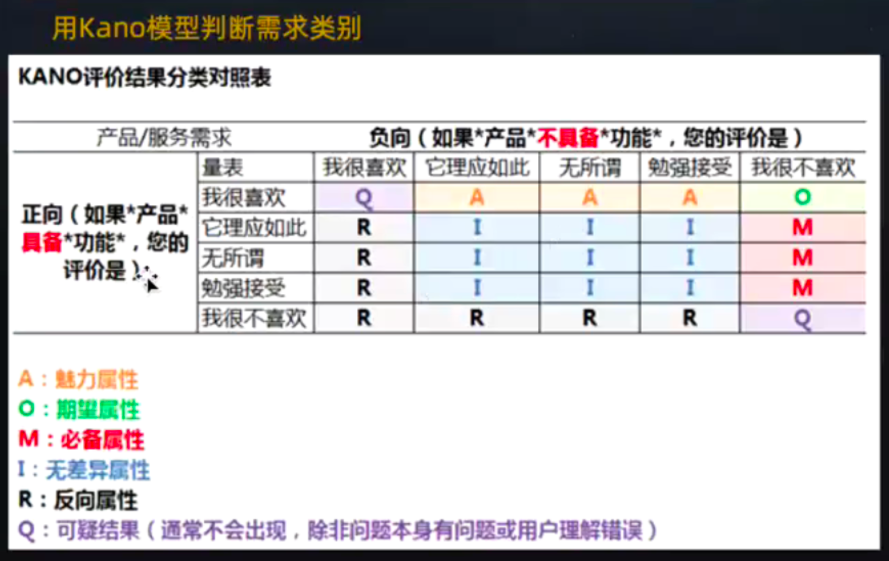

通过对于功能属性归类的百分比，计算出 Better-Worse系数，表示某功能可以增加满意或者消除很不喜欢的影响程度：

增加后的满意系数 **Better/SI=(A+O)/(A+O+M+I)**

Better，可以被解读为增加后的满意系数。better的数值通常为正，代表如果提供某种功能属性的话，用户满意度会提升；正值越大/越接近1，表示对用户满意上的影响越大用户满意度提升的影响效果越强，上升的也就更快。

消除后的不满意系数 **Worse/DSI=-1*(O+M)/(A+O+M+I)**

Worse，则可以被叫做消除后的不满意系数。其数值通常为负，代表如果不提供某种功能属性的话，用户的满意度会降低；值越负向/越接近-1，表示对用户不满意上的影响最大，满意度降低的影响效果越强，下降的越快。

例如：A魅力=10，O期望=40，M必备=20，I无差异=15，R反向=8，Q可疑结果=7

Better/SI=(10+40)/(10+40+20+15)=0.58

Worse/DSI=-1*(40+20)/(10+40+20+15)=-0.70

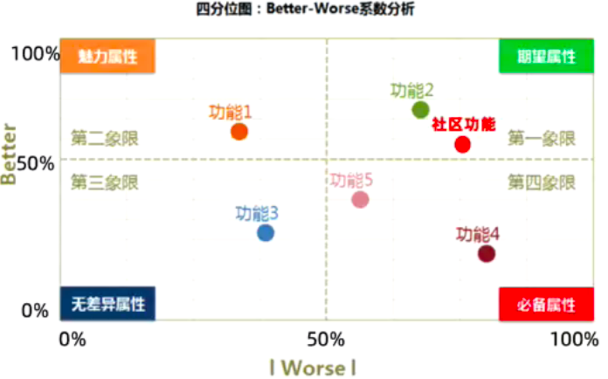

## 二、需求池

定义：各种来源需求的集合地,是各个版本需求的出口

### 需求池包含要素

- 优先级
- 需求来源
- 需求名称
- 需求描述
- 跟进人
- 需求进度

### 需求池原则

有进有出、宽进严出、明确基本属性、保持更新、保持反馈、同步其它相关角色

### 需求池的关联人员

老板：知道大家都在做什么，是否符合大方向

产品经理：正在做和未来要做的任务

开发人员：了解产品需求清单，便于后续工作安排等

测试人员：同开发人员

运营人员：了解需求池，提出新需求

## 三、需求优先级评估

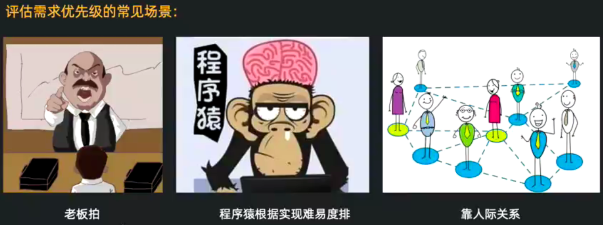

### 重要紧急四象限

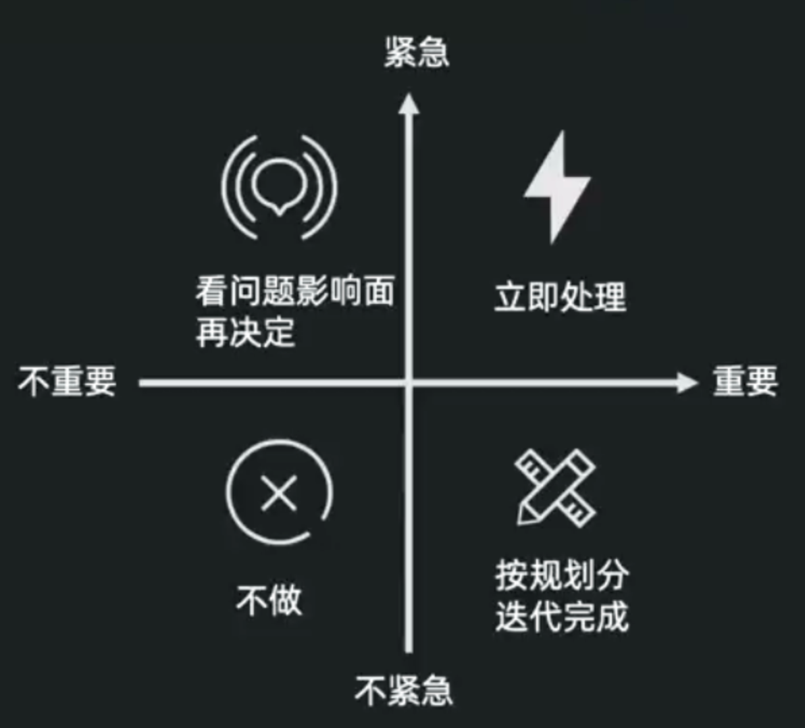

- 紧急又重要的需求太多，代表需求管理有问题

- 重点放在重要不紧急的需求

- 对于紧急不重要的需求，可做，但不要投入过多的人力与精力

- 尽量少做不紧急也不重要的需求

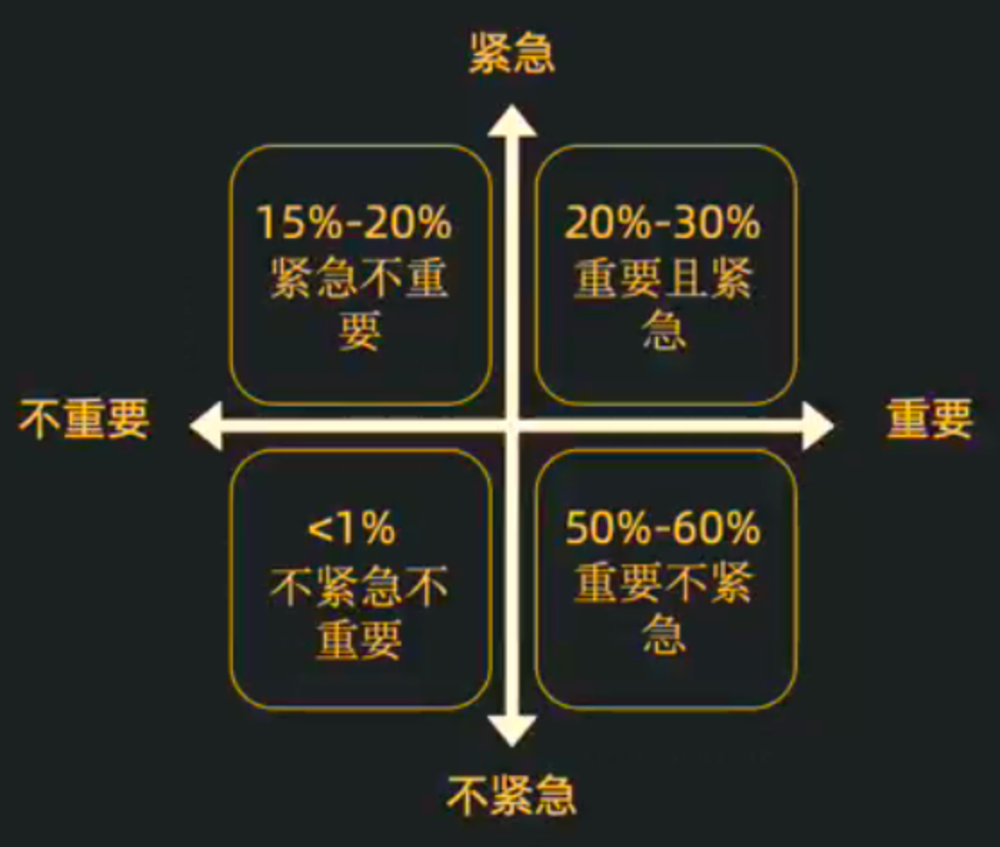

### 产品生命周期法

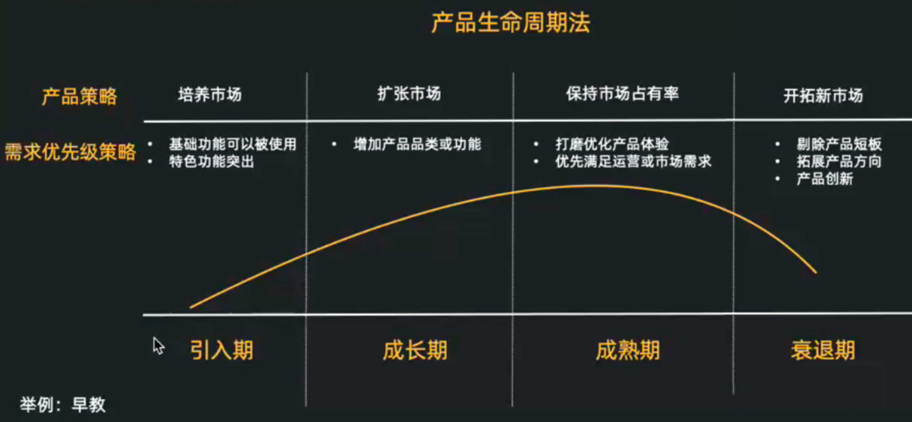

### 金字塔模型法

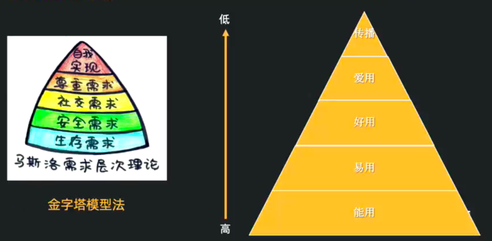

### 场景分析法

影响人数 × 产生问题频次 × 满意度

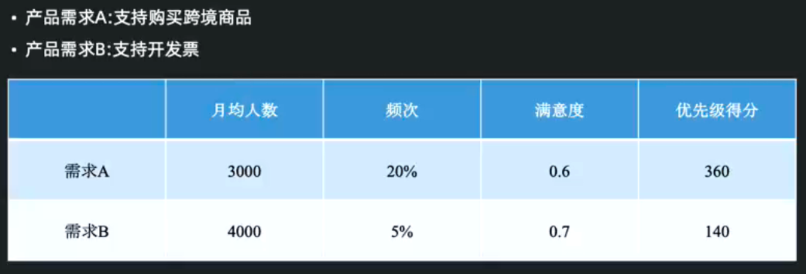

### 用户等级分析法

- 除了考虑覆盖用户量，还要考虑覆盖用户类型

- 核心用户需求优先级更高

- 核心用户是谁？

> 举例：同样是跨境需求，在不同产品上的优先级不同

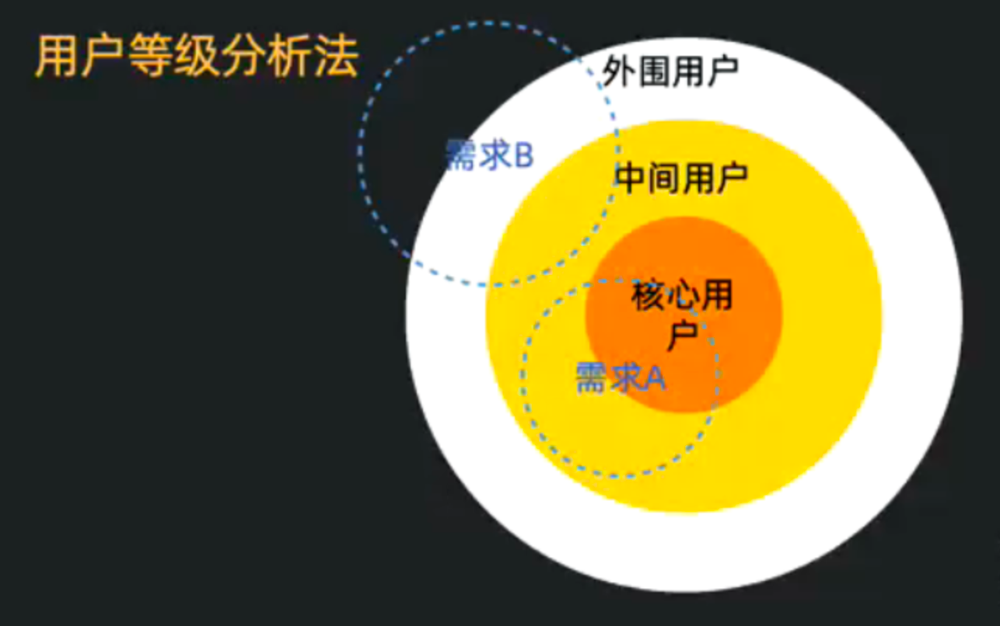

### ROI分析法
ROI投资回报率：Return on Investment
投资回报率(ROI)=(税前年利润/投资总额)*100%

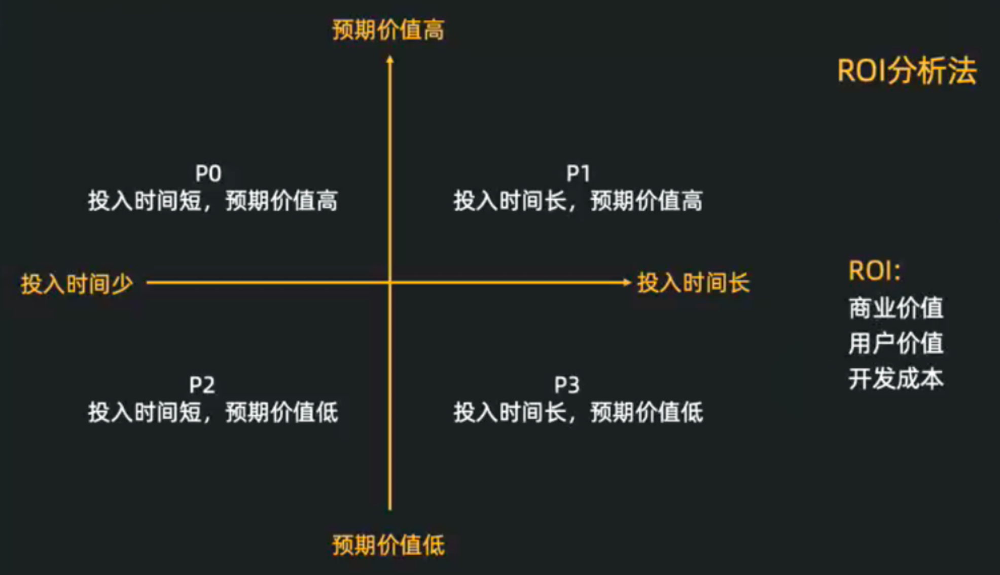