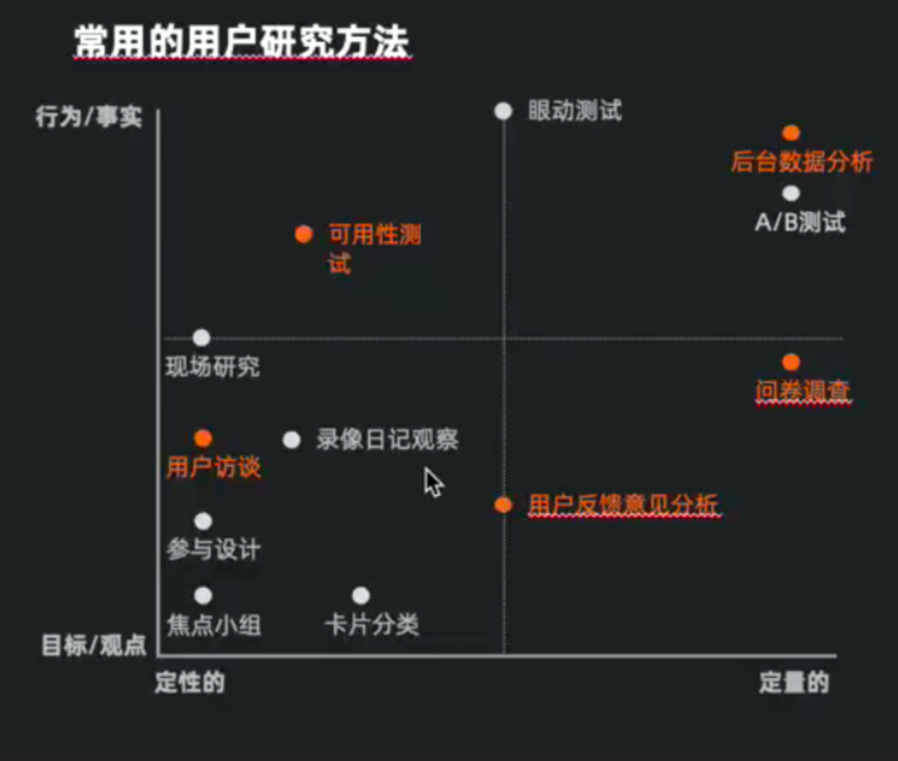
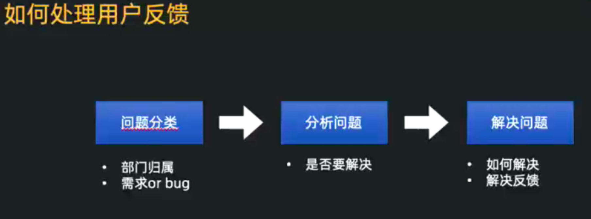
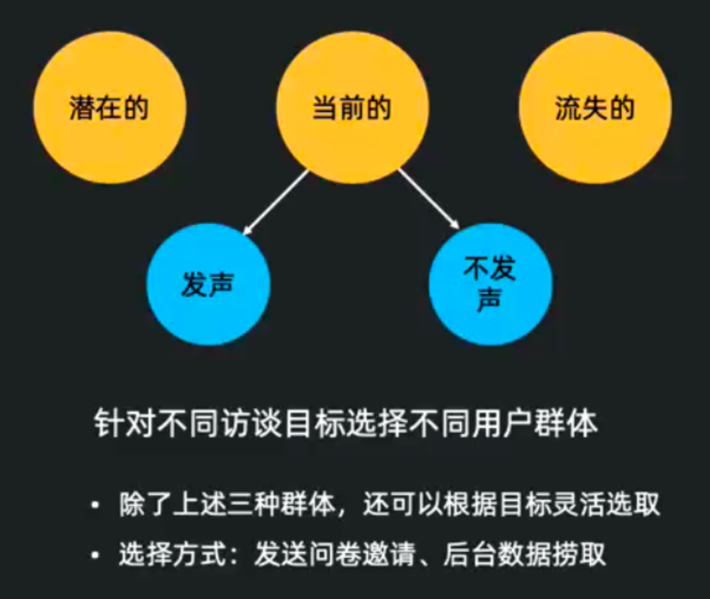

需求采集实际上就是获取/验证需求的方法。其目的就是通过深入了解分析目标用户，发现他们的痛点。

<!-- more -->

定性研究: 从小规模的样本中发现新事物的方法。通过与少数用户(10~20个)互动来得到新想法或揭露以前未知的问题。
定量研究: 用大量的样本来测试和证明某些事情的方法。可验证通过定性研究而发现的假说。

## 用户反馈

为什么搜集用户反馈?
自身产品问题-聆听用户真实的声音
竞品问题-对手的弱点可能就是自己的机会
可能的机会点-集思广益

> 场景: 用户反馈是日常化的工作 

用户反馈有哪些搜集渠道?

公开渠道：应用商店(App Store、应用宝等)，百度贴吧，微博，知乎

建立关键词库、勤搜索、关键字订阅(参考如何巧用百度指数)

半公开渠道：微信群，朋友圈，用户评价，产品反馈

定期搜集用户反馈

内部渠道：用户投诉，电话录音，客服咨询

整合内部用反馈渠道(客服、社群等)定期与一线同事沟通

## 用户访谈

定义：用户访谈是指为获取用户信息而进行的引导性谈话，能够有效理解用户需求、分析用户动机、锁定目标场景。
使用场景:

- 新业务上线

- 数据不能指出问题
- 做用户画像等基础建设

- 探索新的可能

### 选择用户

